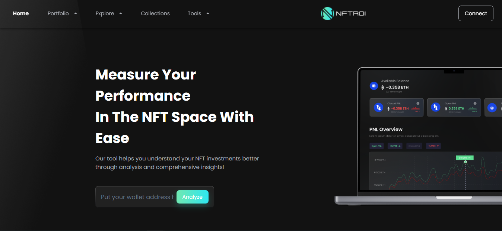
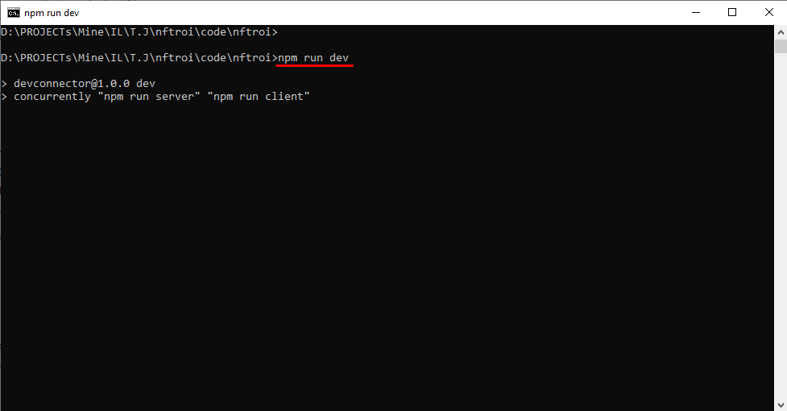

# NFT ROI

## Description
NFT management platform.

## Live site

## Contact info
- **Email:** mr.new0509@gmail.com
- **Telegram:** [@mrnew0509](https://t.me/mrnew0509)
- **Skype:** [@sin085](https://join.skype.com/invite/xat3AgpiRVOI)

## Release date
Jul 11, 2022

## Environment
- `Node.js v18.12.1`

## Stack
- **Framework:** `Express v4.17.1`, `React.js v17.0.2`, `Mongoose v6.3.5`
- **Theme:** `MUI v5.2.2`

## How to run the game.
1. Please open terminal window in the root directory.
2. Please run command `npm run start` in it.

3. You can see the site like the following image if it is run correctly.

